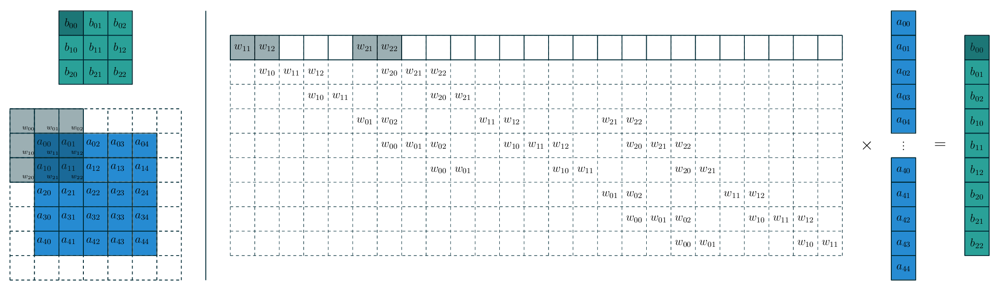
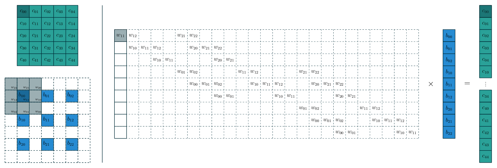
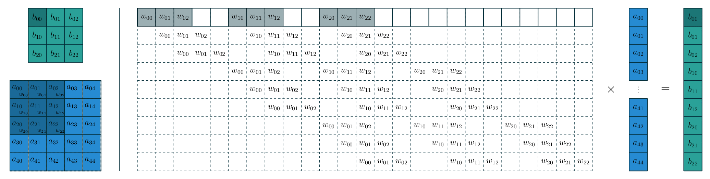
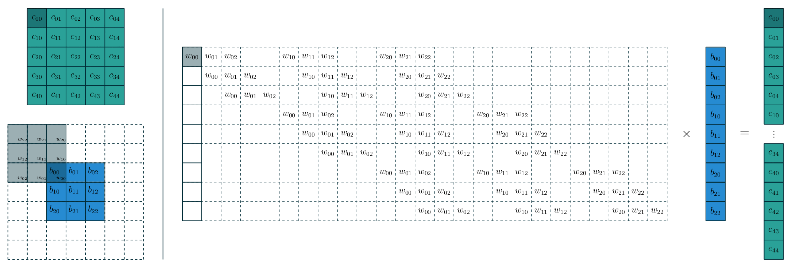

# Convolution Arithmetic Extension

Extension of the [Conv Arithmetic](https://github.com/vdumoulin/conv_arithmetic).

* Example 1: `alphabet_conv_s2`



* Example 2: `alphabet_transposed_conv_s2`



## 1. Preliminary

* [Latex](https://www.ctan.org/tex-archive/systems/texlive/Images): It is recommended to install TexLive 2021.

* [Python 3.x](https://www.python.org/)

```bash
pip install -r requirements.txt
```

* `convert` (converting pdf to png) and `gifsicle`

```bash
sudo apt install imagemagick-6.q16
sudo apt install gifsicle
```

Set ImageMagick security policy 'PDF' blocking conversion ([Ref](https://stackoverflow.com/questions/52998331/imagemagick-security-policy-pdf-blocking-conversion)) by adding

```
<policy domain="coder" rights="read | write" pattern="PDF" />
```

just before `</policymap>` in `/etc/ImageMagick-6/policy.xml`.

If an error about `cache resources exhausted` is raised by `convert-im6.q16`, you must make another modification of the `policy.xml`: 

* change `<policy domain="resource" name="disk" value="1GiB"/>` to `<policy domain="resource" name="disk" value="8GiB"/>`


## 2. Usage of Static Frame

```text
usage: produce_figure.py [-h] {arithmetic,numerical} ...

Compile a LaTeX figure as part of a convolution animation.

positional arguments:
  {arithmetic,numerical}
    arithmetic          convolution arithmetic animation
    numerical           numerical convolution animation

optional arguments:
  -h, --help            show this help message and exit
  -e STEP, --step STEP  animation step. (default: 0)
  -i INPUT_SIZE, --input-size INPUT_SIZE
                        input size. (default: 5)
  -o OUTPUT_SIZE, --output-size OUTPUT_SIZE
                        output size. (default: 3)
  -p PADDING, --padding PADDING
                        zero padding. (default: 0)
  -k KERNEL_SIZE, --kernel-size KERNEL_SIZE
                        kernel size. (default: 3)
  -s STRIDE, --stride STRIDE
                        stride. (default: 1)
  -d DILATION, --dilation DILATION
                        dilation. (default: 1)
  -a, --animation       Make an animation output instead of a single step pdf.
  -y {pdf,png}, --type {pdf,png}
                        Output type of a single frame. (default: png)
  -q QUALITY, --quality QUALITY
                        Quality of the frame. Larger is better. (default: 600)
  -qa QUALITY_ANIMATION, --quality-animation QUALITY_ANIMATION
                        Quality of the animation. Larger is better. (default: 150)

arithmetic optional arguments:
  -t, --transposed      use a transposed convolution

numerical optional arguments:
  -m {convolution,average,max}, --mode {convolution,average,max} 
                        kernel mode (default: convolution)
```

### 2.1 Arithmetic

* conv: input=5, padding=1, kernel=3, stride=2, step=0

```bash
python produce_figure.py arithmetic -i 5 -p 1 -k 3 -s 2 -e 0 arithmetic_conv
```

The output png/pdf is genearted in `./out/`.


* transposed conv: input=5, padding=1, kernel=3, stride=2, step=1

```bash
python produce_figure.py arithmetic -i 5 -p 1 -k 3 -s 2 -e 1 -t arithmetic_transposed_conv
``` 


### 2.2 Numercal

```bash
python produce_figure.py numerical -i 5 -p 1 -k 3 -s 2 numerical_conv
```


```bash
python produce_figure.py numerical -i 6 -k 2 -s 2 numerical_max
```


## 3. Usage of Animation

* Add options to directly generate a gif file that contains all the steps. Just add the `-a` option (and remove the `-e STEP` option, actually it will be omitted) to directly make animations.

```bash
python produce_figure.py arithmetic -i 5 -p 1 -k 3 -s 2 arithmetic_conv -a
```


The gif is genearted in `./gif/`.

```bash
python produce_figure.py arithmetic -i 5 -p 1 -k 3 -s 2 -t arithmetic_transposed_conv -a
```


```bash
python produce_figure.py numerical -i 5 -p 1 -k 3 -s 2 numerical_conv -a
```


```bash
python produce_figure.py numerical -i 6 -k 2 -s 2 numerical_max -a
```


## 4. Conv vs Transposed Conv in a Matrix Multiplication View.

A new mode `alphabet` is introduced for understanding the conv and transposed conv in a matrix multiplication view.

* Stride = 1

```bash
# The first frame
python produce_figure.py alphabet -i 5 -k 3 alphabet_conv
# Animation with lower quality for an acceptable time
python produce_figure.py alphabet -i 5 -k 3 alphabet_conv -a -qa 150
```



```bash
# The first frame
python produce_figure.py alphabet -i 5 -k 3 alphabet_transposed_conv -t
# Animation with lower quality for an acceptable time
python produce_figure.py alphabet -i 5 -k 3 alphabet_transposed_conv -t -a -qa 150
```



* Stride = 2

```bash
# The first frame
python produce_figure.py alphabet -i 5 -k 3 -s 2 -p 1 alphabet_conv_s2
# Animation
python produce_figure.py alphabet -i 5 -k 3 -s 2 -p 1 alphabet_conv_s2 -a -qa 150
```


```bash
# The first frame
python produce_figure.py alphabet -i 5 -k 3 -s 2 -p 1 alphabet_transposed_conv_s2 -t
# Animation
python produce_figure.py alphabet -i 5 -k 3 -s 2 -p 1 alphabet_transposed_conv_s2 -t -a -qa 150
```


## 5. Notes

Here we list some notes when using the library.

* Automatically compute the output size in `arithmetic - conv`.
* Dilation rate is fixed to 1 in `arithmetic - transposed conv`.
* The arguments for `transposed conv` is actually the arguments of the corresponding `conv`. Using the term in the paper, the user should input `i, o, k, p, s`, instead of `i', o', k', p', s'`. 


## Acknowledgement

Thanks to [vdumoulin/conv_arithmetic](https://github.com/vdumoulin/conv_arithmetic).
